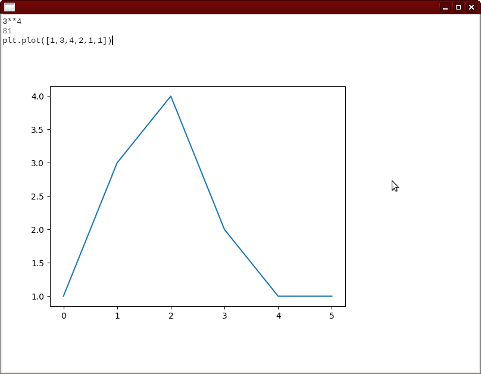

# goggles

*Because our current debug/test/profiling tooling is stuck in the 80s*

An experiment in building a tool to make working with Python code more
interactive, intelligent, visual, and convenient.

# inspiration
* [Jupyter](https://jupyter.org/)
* [streamlit](https://www.streamlit.io/)
* [Pluto.jl](https://github.com/fonsp/Pluto.jl)
* [Observable](https://observablehq.com/)
* Emacs
* [Expect tests](https://blog.janestreet.com/testing-with-expectations/)
* Smalltalk
* [Studio](https://github.com/studio/studio)
* gdb
* tools built by game developers (e.g. [imgui](https://github.com/ocornut/imgui), [debugging](https://youtu.be/YE8MVNMzpbo?t=1441) and [profiling tools](https://youtu.be/YE8MVNMzpbo?t=2092) built for [the Witness](http://the-witness.net/))
* Mike Acton's [talk](https://www.youtube.com/watch?v=x_BUnm-bnik) that emphasizes the importance of visualization in his problem solving and debugging process.
* Edward Tufte's work on data visualization
* Bret Victor
* [Where's my simulator?](https://shalabh.com/programmable-systems/wheres-my-simulator.html)
* Chrome Devtools
* [Subtext](http://www.subtext-lang.org/)

## workbench

A rich REPL for python built in skia

